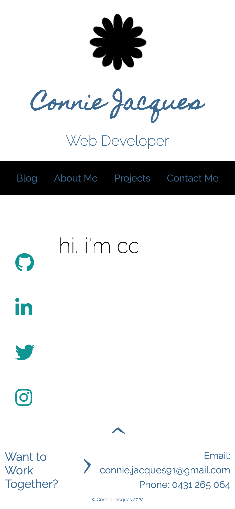

# Website Portfolio for Connie Jacques, web developer

### Access
The published website can be accessed at: https://conniejacquesdev.netlify.app/

GitHub repository: https://github.com/ConnieJacques/ConnieJacques_T1A2

### Presentation Video

### Description
This website portfolio contains infomation about Connie Jacques, a full-stack web developer in training, and showcases some of her work. The header navigation bar will direct the user to learn more about Connie, view her current projects, read her blog and get in contact with her. Her socials can be accessed through the side navigation bar. 

### Purpose
The purpose of this protfolio website is to present myself as a web developer and infomation technology professional with the goal of presenting infomation about myself, my skillset, interests, professional knowledge and background and showcase my relevant work.

### Functionality/Features
Key features of this website are: 
- A header that contains the logo and navigation to other sections of the page. A horizontal navigation bar has been used for ease of use by the user. This bar displays on all pages of the website and utilises responsive design to ensure it is clearly visable and ease to read the directory on all viewports. The page logo returns the user to the landing page for ease of use in returning to home. 
- Similarly, a sticky side navigation bar is used on several pages. This bar uses the icon-logos for external websites for ease of recognition and use. It was designed to provide ready access to my socials from appropriate pages.
- A footer bar is present on all pages and contains reactive links to email or telephone me. These links are designed to work with the users device to send an email or initiate a phone call. The purpose of this is to make contacting me as accessable as possible for all users. 
- The about me page provides an pdf version of a resume that opens in a tab. This makes printing or saving a copy of the resume for later reference easy for potential employers.
- My blog landing page contains a carousel/slider list of some of the most popular blog posts. The goal of this is simply to showcase my ability to build an elegant slider. As a carousel is the most accessable feature for all users, a navigation bar is provided at the top of the landing page that take users to three different topics of interest and from there displays all the appropriate blog posts on easily accessable tiles in a column format.
- All images contain alternative text for use with screen readers.

### Sitemap

### Screenshots
**Wireframes**
Basic black and white wireframes were used to provide an outline of the page layout and required sections to successfully construct the desired arrangement.

**Screenshots**
Screenshots of all pages at mobile, tablet and laptop viewports to showcase what has been accompished.

### Target Audience
The target audience for this portfolio website is an employer looking to hire a web developer with a sound working knowledge of infomation technology and software developement via coding in specific programming languages on various developement stacks. It is assumed that the employer would have high expectations of professionalism and desire a positive work ethic.

### Tech Stack
This online portfolia was written exclusively in html and scss, utilising sass/scss to increase accessibility for the developer to make future changes via the use of partials, mixins and variables. The website has been deployed on netlify.app.

## Credit Where Credit Due -

Browser Icon *Icq Icon in Glyph Style* by Fontello at Icon Scout. Accessed at https://iconscout.com/icons/icq. (Accessed on 3 November 2022).

Icons for Sticky Side Navigation Bar from Icon Awesome at https://fontawesome.com/v4/icons/. (Accessed on 3 November 2022)
- GitHub accessed at https://fontawesome.com/v4/icon/github
- LinkedIn accessed at https://fontawesome.com/v4/icon/linkedin
- Twitter accessed at https://fontawesome.com/v4/icon/twitter
- Instagram accessed at https://fontawesome.com/v4/icon/instagram

$main-font credit Google Fonts, *Raleway*, designed by Matt McInerney, Pablo Impallari, Rodrigo Fuenzalida. Accessed at https://fonts.google.com/specimen/Raleway (Accessed on 3 November 2022).

$arrow-font credit Google Fonts, *Alex Brush*, designed by Robert Leuschke. Accessed at https://fonts.google.com/specimen/Alex+Brush?category=Handwriting&preview.text=%3E%20%5E&preview.text_type=custom (Accessed on 3 November 2022).

$handwritten-font credit Google Fonts, *Homemade Apple*, designed by Font Diner. Accessed at https://fonts.google.com/specimen/Homemade+Apple?category=Handwriting&query=Homemade+Apple (Accessed on 5 November 2022).

Mock resume credit of doctemplates.net (2022) *20 Excellent Web Developer Resume Examples (Free Templates)*. Accessed at https://www.doctemplates.net/web-developer-resume-examples-templates/ (Accessed on 6 November 2022).

code.jpg image for blog1 credit of Arnold Francisca on Unsplash. Accessed at https://unsplash.com/photos/f77Bh3inUpE. (Accessed on 8 November 2022).

vet.jpg image for blog2 credit of Hush Naidoo Jade Photography on Unsplash. Accessed at https://unsplash.com/photos/yo01Z-9HQAw (Accessed on 8 November 2022).

computer.jpg image for blog3 credit of Kari Shea on Unsplash. Accessed at https://unsplash.com/photos/1SAnrIxw5OY (Accessed on 8 November 2022).

coffee.jpg image for blog4 credit of 
Hayley Kim Design on Unsplash.
Accessed at https://unsplash.com/photos/b01zgiTaMYE (Accessed on 8 November 2022).

rosie.jpg image for blog5 © Connie Jacques 2022.